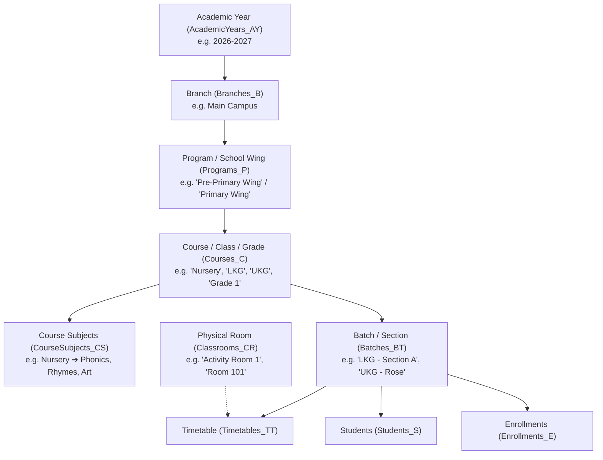

# Pre-Primary & Primary School Academic Structure Plan

## Executive Summary & Problem Analysis

In [`script_19_09_2026.sql`](file:///d:/1Common/ExtraPush/IMS/erp-ims/database/script_19_09_2026.sql), you noticed there is **no table named `Classes` or `Classes_CL`**. 

This is because the ERP was architected with universal academic tier terminology (`Programs_P` → `Courses_C` → `Batches_BT` → `Classrooms_CR`):
- In higher-ed/colleges: `Program` = B.Tech, `Course` = CS101, `Batch` = 2026 Batch.
- In K-12 / Pre-Primary / Primary Schools: **`Course` IS the Class/Grade**, **`Batch` IS the Section/Cohort**, and **`Program` IS the School Wing/Level**.

---

## 1. How the Existing Database Models Pre-Primary & Primary Schools

Here is the exact 1-to-1 mapping between School Concepts and the current database tables in [`script_19_09_2026.sql`](file:///d:/1Common/ExtraPush/IMS/erp-ims/database/script_19_09_2026.sql):

### Concept Comparison Table

| Real-world School Concept | Current Database Table | Concrete Pre-Primary Example | Concrete Primary School Example |
|---|---|---|---|
| **Academic Session** | `AcademicYears_AY` | `2026 - 2027` | `2026 - 2027` |
| **School Level / Wing** | `Programs_P` | `Pre-Primary (Early Childhood)` | `Primary Wing (Grades 1–5)` |
| **Class / Grade** | `Courses_C` | `Nursery`, `LKG`, `UKG`, `Playgroup` | `Grade 1`, `Grade 2`, `Grade 3` |
| **Section / Division** | `Batches_BT` | `LKG - Section A`, `UKG - Buttercups` | `Grade 1 - Section A (Rose)` |
| **Subjects / Activities** | `Subjects_SB` | `Rhymes & Story`, `Phonics`, `Drawing` | `English`, `Mathematics`, `EVS` |
| **Class Curriculum** | `CourseSubjects_CS` | Links `LKG` to `Phonics` & `Rhymes` | Links `Grade 1` to `English`, `Maths` |
| **Physical Room** | `Classrooms_CR` | `Kindergarten Play Hall`, `Room KG-01` | `Classroom 101`, `Junior Lab` |
| **Student Enrollment** | `Enrollments_E` | Enrolls child in `2026-27 / LKG / Sec-A` | Enrolls child in `2026-27 / Gr-1 / Sec-B` |
| **Class Schedule** | `Timetables_TT` | Schedule for `LKG - Sec A` | Schedule for `Grade 1 - Sec B` |

---

## 2. Proposed Architectural Options

### Approach 1 (Recommended): Domain Terminology / UI Aliasing (Zero Database Risk)
> [!TIP]
> This is how leading educational ERPs (OpenEduCat, ERPNext, Fedena) operate without breaking relational schemas across 58 tables.

* **Database schema**: Remains unchanged (`Programs_P`, `Courses_C`, `Batches_BT`, `Classrooms_CR`).
* **UI & Configuration**: 
  - Update `MasterConfigRegistry.cs`, UI labels, placeholders, and tooltips to clearly reflect **"Class / Grade Master"** instead of "Course Master", and **"Section / Batch"** instead of "Batch".
  - Add help text and guidance explaining how to set up Pre-Primary Wings (`Playgroup`, `Nursery`, `LKG`, `UKG`) and Primary Wings (`Class 1` to `Class 5`).
* **Pros**:
  - ✅ Zero breaking changes across the 58 database tables, 30+ stored procedures, and 20+ services.
  - ✅ Works immediately with existing Timetables, Attendance, Examination, Fees, and Admissions modules.
  - ✅ Retains multi-tier capability if the institution has pre-school, school, and higher secondary branches.

---

### Approach 2: Full Database Schema Refactoring (Dedicated `Classes_CL` & `Sections_SEC`)
> [!WARNING]
> Renaming/introducing new tables requires extensive database migrations and refactoring across the entire codebase.

* **Changes required**:
  - Create new tables or rename `Courses_C` → `Classes_CL` and `Batches_BT` → `Sections_SEC`.
  - Rewrite 18 Foreign Key constraints (`FK_Students_Batches`, `FK_Enrollments_Courses`, `FK_FeeStructures_Courses`, `FK_Exams_Courses`, `FK_AttendanceSessions_Batches`, `FK_Timetables_Batches`, etc.).
  - Rewrite ~35 SQL Stored Procedures (`USP_Courses_C` → `USP_Classes_CL`, `USP_Batches_BT` → `USP_Sections_SEC`, `USP_Students_S`, `USP_Enrollments_E`, `USP_Fees_F`, etc.).
  - Refactor 14 C# ViewModels, 8 Service classes, 8 DAL repositories, and 20+ Razor views.
* **Pros**: Table names in SQL directly match school vocabulary.
* **Cons**: High regression risk, substantial migration downtime, and high maintenance overhead.

---

## 3. Step-by-Step Practical Setup Guide for Pre-Primary & Primary

To set up a Pre-Primary & Primary School in the current system:

1. **Academic Year** (`/Master/AcademicYear`):
   - Name: `2026-2027` | Code: `AY-26-27`
2. **School Wings / Levels** (`/Master/Program`):
   - Level 1: Name = `Pre-Primary (Early Years)` | Code = `PRE-PRI`
   - Level 2: Name = `Primary Wing (Grades 1-5)` | Code = `PRI`
3. **Classes / Grades** (`/Master/Course`):
   - Under Pre-Primary: `Playgroup`, `Nursery`, `LKG (Lower Kindergarten)`, `UKG (Upper Kindergarten)`
   - Under Primary: `Class 1`, `Class 2`, `Class 3`, `Class 4`, `Class 5`
4. **Subjects** (`/Master/Subject`):
   - Pre-Primary: `English Phonics`, `Nursery Rhymes & Story`, `Art & Colouring`, `Basic Numeracy`, `Physical Activity`
   - Primary: `English Literature`, `Mathematics`, `Environmental Studies (EVS)`, `Hindi/Regional Language`, `Computer Basics`
5. **Class-Subject Curriculum** (`/CourseSubject`):
   - Assign `Phonics`, `Rhymes`, `Drawing` to `Nursery` and `LKG`.
   - Assign `English`, `Maths`, `EVS` to `Class 1`.
6. **Sections / Cohorts** (`/Batch`):
   - Create `LKG - Section A (Sunshine)`, `LKG - Section B (Buttercups)` linked to `2026-2027` + `LKG`.
   - Create `Class 1 - Section A (Lotus)`, `Class 1 - Section B (Rose)` linked to `2026-2027` + `Class 1`.
7. **Physical Classrooms** (`/Master/Classroom`):
   - `Room KG-01 (Play Area)`, `Room 101 (Class 1-A)`, `Room 102 (Class 1-B)`.
8. **Timetable & Daily Schedule** (`/Timetable`):
   - Schedule periods for each Section/Batch with teachers and rooms.
9. **Student Admissions & Enrollments** (`/AdmissionApplication` & `/Enrollment`):
   - Admit students and assign them to their respective Class & Section.

---

## 4. Proposed Implementation Changes (Under Approach 1)

### [MODIFY] [`MasterConfigRegistry.cs`](file:///d:/1Common/ExtraPush/IMS/erp-ims/IMS.Models/Common/Master/MasterConfigRegistry.cs)
- Update Display Names and Field Labels:
  - **Program Master** → `School Level / Program Master` (Helper: *"e.g. Pre-Primary, Primary, Middle School"*).
  - **Course Master** → `Class / Course Master` (Helper: *"e.g. Nursery, LKG, UKG, Class 1 - 10"*).
  - **Subject Master** → `Subject / Activity Master` (Helper: *"e.g. Phonics, Rhymes, Mathematics"*).
  - **Classroom Master** → `Physical Classroom / Hall Master` (Helper: *"e.g. KG Playroom, Room 101"*).

### [MODIFY] [`_PartialSidebar.cshtml`](file:///d:/1Common/ExtraPush/IMS/erp-ims/IMS.Web/Views/Shared/_PartialSidebar.cshtml)
- In the sidebar navigation labels, clarify:
  - `Courses` → `Classes / Courses`
  - `Batches` → `Sections / Batches`
  - `Course Subjects` → `Class Subjects`

### [MODIFY] [`README_MENUS_HIERARCHY.md`](file:///d:/1Common/ExtraPush/IMS/erp-ims/README_MENUS_HIERARCHY.md)
- Add the Pre-Primary and Primary School domain mapping guide to the project documentation so all developers and users share the same clear mental model.

---

## 5. Verification Plan

### Manual Verification
1. Navigate to `/Master/Program` and create `Pre-Primary (Early Years)`.
2. Navigate to `/Master/Course` and create `Nursery` and `LKG` under `Pre-Primary`.
3. Navigate to `/Master/Subject` and create `Phonics & Rhymes`.
4. Navigate to `/CourseSubject/Create` and link `LKG` to `Phonics & Rhymes`.
5. Navigate to `/Batch/Create` and create `LKG - Section A`.
6. Navigate to `/Timetable/Create` and assign a teacher for `LKG - Section A`.
7. Verify all dropdowns, lists, and forms show clear, intuitive labels for pre-primary school workflows.
